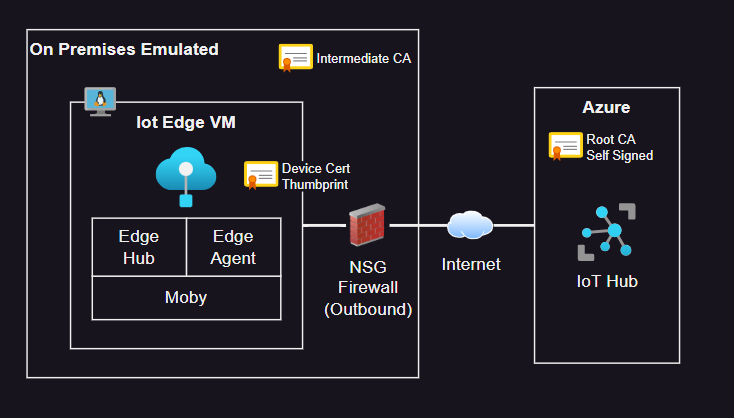

# Azure IoT Edge Troubleshooting

Troubleshooting IoT Edge connectivity and configuration.



## Infrastructure

### 1 - Create the resources

Generate the test-only certificate chain:

```sh
bash scripts/generateCerts.sh
```

Deploy the resources:

```sh
terraform -chdir="infra" init
terraform -chdir="infra" apply -auto-approve
```

<details>
  <summary>(Optional) Upgrade IoT Hub certificate to V2 (DigiCert)</summary>

  ```sh
  az iot hub certificate root-authority set --hub-name "iot-bluefactory" --certificate-authority v2 --yes
  ```
</details>

Make sure the EdgeGateway has completed the installation:

```sh
# Connect to the IoT Edge VM
ssh edgegateway@<public-ip>

# Check if the cloud-init status is "done", otherwise wait with "--wait"
cloud-init status

# Confirm that the IoT Edge runtime has been installed
iotedge --version
```

Restart the VM to activate any Linux kernel updates:

```sh
az vm restart -n "vm-bluefactory-edgegateway" -g "rg-bluefactory"
```

### 2 - Register the IoT Edge device

Run the script to create the IoT Hub device registration:

> ⚠️ IoT Hub supports registering IoT Edge devices only through self-signed method (certificate thumbprint). For a CA-Signed configuration, you must implement device enrollment with DPS. See [this issue](https://github.com/MicrosoftDocs/azure-docs/issues/108363) for details.

```sh
bash scripts/registerEdgeGatewayDevice.sh
```

Upload the required configuration files to the EdgeGateway device:

```
bash scripts/uploadEdgeConfig.sh
```

Connect with SSH to the EdgeGateway and execute the configuration

```sh
sudo bash edgeConfig.sh
```

Verify the results:

```sh
sudo iotedge system status
sudo iotedge system logs
sudo iotedge check
```

### 3 - Deploy the modules

Now that the device is properly registered and connect with IoT Hub, create a deployment:

```sh
az iot edge deployment create --deployment-id "gateway" \
    --hub-name $(jq -r .iothub_name infra/output.json) \
    --content "@edgegateway/deployments/gateway.json" \
    --labels '{"Release":"001"}' \
    --target-condition "deviceId='EdgeGateway'" \
    --priority 10
```

To check the deployment in the EdgeGateway device:

```sh
iotedge list
```

## Troubleshooting


