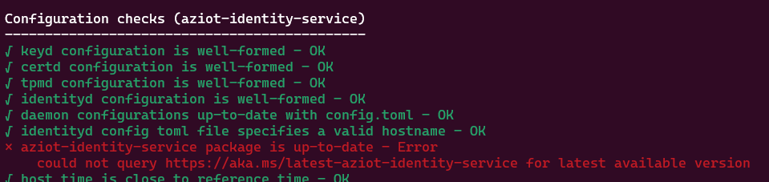

# Azure IoT Edge Troubleshooting

Troubleshooting IoT Edge connectivity and configuration.


## Infrastructure

### 1 - Create the resources

Generate the test-only certificate chain:

```sh
bash scripts/generateCerts.sh
```

Deploy the resources:

```sh
terraform -chdir="infra" init
terraform -chdir="infra" apply -auto-approve
```

<details>
  <summary>(Optional) Upgrade IoT Hub certificate to V2 (DigiCert)</summary>

  ```sh
  az iot hub certificate root-authority set --hub-name "iot-bluefactory" --certificate-authority v2 --yes
  ```
</details>

Make sure the EdgeGateway has completed the installation:

```sh
# Connect to the IoT Edge VM
ssh edgegateway@<public-ip>

# Check if the cloud-init status is "done", otherwise wait with "--wait"
cloud-init status

# Confirm that the IoT Edge runtime has been installed
iotedge --version
```

Restart the VM to activate any Linux kernel updates:

```sh
az vm restart -n "vm-bluefactory-edgegateway" -g "rg-bluefactory"
```

### 2 - Register the IoT Edge device

Run the script to create the IoT Hub device registration:

> ⚠️ IoT Hub supports registering IoT Edge devices only through self-signed method (certificate thumbprint). For a CA-Signed configuration, you must implement device enrollment with DPS. See [this issue](https://github.com/MicrosoftDocs/azure-docs/issues/108363) for details.

```sh
bash scripts/registerEdgeGatewayDevice.sh
```

Upload the required configuration files to the EdgeGateway device:

```
bash scripts/uploadEdgeConfig.sh
```

Connect with SSH to the EdgeGateway and execute the configuration

```sh
sudo bash edgeConfig.sh
```

Verify the results:

```sh
sudo iotedge system status
sudo iotedge system logs
sudo iotedge check
```

### 3 - Deploy the modules

Now that the device is properly registered and connect with IoT Hub, create a deployment:

```sh
az iot edge deployment create --deployment-id "gateway" \
    --hub-name $(jq -r .iothub_name infra/output.json) \
    --content "@edgegateway/deployments/gateway.json" \
    --labels '{"Release":"001"}' \
    --target-condition "deviceId='EdgeGateway'" \
    --priority 10
```

To check the deployment in the EdgeGateway device:

```sh
iotedge list
```

Check and confirm that everything is OK:

```sh
sudo iotedge check
```

All connectivity checks should be:


## Troubleshooting

### Restrict Public Access

Connect to the Portal and disable public access. Do not yet apply to the built-in endpoint. Run the check:

```sh
# Restart
sudo iotedge system restart

# Check
sudo iotedge check
```

Now apply turn-on the toggle to apply to the built-in endpoint.


Run the check:

```sh
# Restart
sudo iotedge system restart

# Check
sudo iotedge check
```

This test demonstrates that even when blocking all traffic, including the built-in endpoint, the check tool will give it OK ✅ for all checks.


After restarting the VM, one error was shown on configuration:


### Remove Root Certificate

Let's try removing the Root certificate in this example:

```sh
# Get the "etag"
etag=$(az iot hub certificate list --hub-name iot-bluefactory --query value[0].[etag] -o tsv)

# Delete the certificate
az iot hub certificate delete --hub-name iot-bluefactory --name TerraformRootCA --etag $etag
```

Restart and run the check:

```sh
# Restart
sudo iotedge system restart

# Check
sudo iotedge check
```

It was possible to demonstrate that no impact occurred when removing the main certificate:


Re-create the certificate:

```sh
# Create the certificate
az iot hub certificate create --hub-name iot-bluefactory --name TerraformRootCA --path ./openssl/certs/azure-iot-test-only.root.ca.cert.pem --verified

# Restart
sudo iotedge system restart

# Check
sudo iotedge check
```

### Remove the Device

Let's try and remove the Device Registration from IoT Hub.

```sh
# Delete the device
az iot hub device-identity delete --hub-name iot-bluefactory --device-id EdgeGateway

# Restart
sudo iotedge system restart

# Check
sudo iotedge check
```

In this scenario, the check tool will present only one error, while connectivity remains ok:


To re-register the device:

```sh
# Register the device
bash scripts/registerEdgeGatewayDevice.sh

# Restart
sudo iotedge system restart

# Check
sudo iotedge check
```

Previous deployments have to be applied again:

```sh
# Create the deployment
az iot edge deployment create --deployment-id "gateway-reapply" \
    --hub-name $(jq -r .iothub_name infra/output.json) \
    --content "@edgegateway/deployments/gateway.json" \
    --labels '{"Release":"001"}' \
    --target-condition "deviceId='EdgeGateway'" \
    --priority 10

# List the containers
iotedge list
```

### Firewall ports block

This test will demonstrate the results when outgoing connectivity is blocked in the Firewall.

Delete the IoT Edge outbound allow rule in the NSG:

```sh
# Delete the rule
az network nsg rule delete -g rg-bluefactory --nsg-name nsg-bluefactory-edgegateway -n AllowIoTEdge

# Check
sudo iotedge check
```

It is possible to identify several failures for this test.

> ℹ️ One aspect of this test is that the test takes a lot of time due to timeout for each connection




Running the checks with `--verbose` will reveal the timeout details:


Running telnet will achieve the same result:


Recreate the rule to proceed with the remaining tests:

```sh
# Create the IoT Edge rule
az network nsg rule create -g rg-bluefactory --nsg-name nsg-bluefactory-edgegateway -n AllowIoTEdge \
    --priority 110 \
    --direction "Outbound" \
    --source-address-prefixes '*' \
    --source-port-ranges '*' \
    --destination-address-prefixes '*' \
    --destination-port-ranges 5671 8883 443 \
    --access "Allow" \
    --protocol "Tcp" \
    --description "Allows IoT Edge connectivity ports."

# Check
sudo iotedge check
```

### Origin restriction

Now let's change the origin parameters to DENY immediately:

```sh
# Create a DENY rule with priority 101
az network nsg rule create -g rg-bluefactory --nsg-name nsg-bluefactory-edgegateway -n DenyIoTEdge \
    --priority 101 \
    --direction "Outbound" \
    --source-address-prefixes '*' \
    --source-port-ranges '*' \
    --destination-address-prefixes '*' \
    --destination-port-ranges 5671 8883 443 \
    --access "Deny" \
    --protocol "Tcp" \
    --description "Deny rule to test connectivity behavior."

# Check
sudo iotedge check
```

Connections will fail with timeout:


To continue, remove the DENY rule:

```sh
# Remove the DENY rule
az network nsg rule delete -g rg-bluefactory --nsg-name nsg-bluefactory-edgegateway -n DenyIoTEdge

# Check
sudo iotedge check
```

### DNS

TODO: Fail with DNS

### Docker Forward

TODO: Change IP forwarding


## Utilities

- [Several IoT Edge utilities](https://sandervandevelde.wordpress.com/category/docker/)
- [IoT ELMS](https://github.com/Azure-Samples/iotedge-logging-and-monitoring-solution)
- [IoT Edge runtime host network mode](https://github.com/Azure/iotedge/issues/5935)
